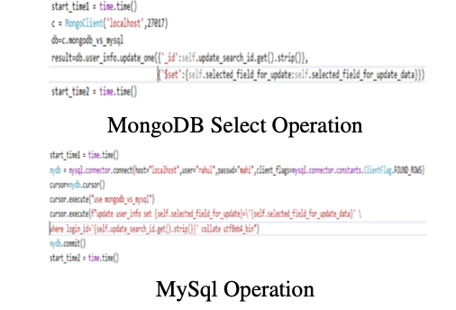

# COMPARATIVE ANALYSIS OF MySql AND MongoDB DATABASES

## 1. Abstract

Since MySQL’s release in 1995, the relational database has served as the backbone of business applications and has become a well-liked and reasonably priced tool. A database is a collection of information that has been structured in tables for easy access, management, and updating. MySQL is the most widely used relational SQL database in the open-source community. It is mainly used for websites that are powered by open-source software MongoDB is the most commonly used nonrelational SQL database. It enables the investigation of novel information storage techniques. It gains popularity primarily due to its scalability and adaptability for Big Data and Cloud Computing. However, non-relational database systems like MongoDB have lately evolved to answer the demands of new applications due to the growth in the volume and variety of data. In addition to being utilized for brand-new applications, existing relational infrastructure may be supplemented or replaced using MongoDB. In contrast to NoSQL databases, whose schema is dynamic and horizontally scalable, SQL databases have predetermined, fixed, and vertically scalable schema. In addition, although NoSQL databases are documentbased, key-value-based, and graph databases like MongoDB, CouchDB, etc., SQL databases are table-based databases like MySQL, Oracle, and MS SQL. The main topic is the query performance comparison between MySQL and MongoDB databases. In this project, we have attempted to present a case study comparing relational and non-relational databases. We primarily focus on the MongoDB application of the NoSQL database technology and compare it to the MySQL use of relational databases to demonstrate the performance efficiency based on database insert, select (fetch), update, and delete operations between MongoDB and MySQL. The advantages of utilising a nonrelational database over a relational database will also be discussed. Theoretical distinctions, traits, limitations, integrity, distribution, system specifications, architecture, query, and insertion times are all included in a comparison criterion.

## 2. Introduction

There are apps now that have millions of users connected day and night, year in and year out, as opposed to a few years ago when an application would typically only have thousands of users or tens of thousands of users in the most extreme situation. Utilizing a database that can handle hundreds of thousands of simultaneous connections is crucial. Most applications worldwide utilize relational databases and perform well for handling small amounts of data. Conventional relational databases are ineffective in managing a massive volume of data, such as the internet, multimedia, and social media. The ”NO SQL” keyword was created to address this issue. Carlo Strozzi first coined the word ”NoSQL” to describe nonrelational databases in 1998. Eric Evans later revived the phrase in 2009. In contrast to its original meaning, the anti-relational, the word now has a different meaning, ”Not Only SQL,” which is a more forgiving definition of the term. NoSQL is a technique of several related and conflicting technologies rather than a single tool. A NoSQL database’s main advantage is that, in contrast to a relational database, it can effectively manage unstructured data, including documents, emails, multimedia, and social media. Nonrelational databases don’t adhere to the RDBMS (Relational Database Management System) concepts, don’t utilise tables to store data, and have a fundamental data model. Instead, they employ identifying keys, and the allocated keys may be used to find data.

### 3. Overview of MySql

Oracle Corporation maintains, develops, and provides support for the MySQL relational database management system (RDBMS), a well-known open-source RDBMS. SQL is a structured query language used by relational databases like MySQL to retrieve tabular data. The schema for a MySQL database should be specified based on the needs, and rules should be established to regulate the relationships between the columns in a record. Although the relevant data may be stored in many tables, joins are used to link them together. Data duplication can be reduced as a result.

## 4. Problem Definition:

A database management system is essential for data generation and administration. Every server-based programme, whether a desktop application or a web application, has to perform the tasks of data creation and data maintenance. Several database systems are operating on various concepts nowadays. They have two main components: NoSQL-based database systems like MongoDB and SQL-based database systems like MySQL. MySQL is a database connected to tables and foreign keys, while MongoDB is a document storage database (key-value based). There are two basic methods of replication that MongoDB offers.

• Master-Slave - In master-slave replication, the master is in charge of complete data access and is the one who notifies its slaves of any changes. The enslaved people are limited to reading data.

• Replica sets - Replica sets function similarly to master-slave replications, except if the original master goes down, a new master can be chosen.

Automatic sharding is a crucial feature that MongoDB supports. With the use of this functionality, data may be divided across several nodes. For each collection, the administrator must validate a sharding key that specifies how to divide the documents. In such a setting, the clients connect to a unique master node known as the mongos process, which examines the query and directs it to the proper node or nodes. Every logical node has physical servers acting as replica sets to prevent data loss. Using this architecture, it is also feasible to utilise Map/Reduce, which has excellent
performance.

## 5 NoSQL Databases:

The phrase ”NoSQL” does not refer to a particular technology. All non-relational databases are included. They almost all share the following characteristics:

- limitation of SQL language support; nonetheless, most NoSQL databases define their query
  languages, some of which have syntaxes comparable to SQL, such as CQL for Cassandra,

– lack of relation between data,
– developed for working in clusters,
– no ACID transactions,
– flexible data model.

In a non-relational database, there are four
methods for storing data, as demonstrated in:

- Key-Value - Key-Value databases are schemaless conceptual distributed dictionaries without a
  predetermined schema. The value may be a string,
  JSON, BLOB, or another type, and the key may
  be artificial or self-generated.

- Document - The most well-known documentbased database is MongoDB. They don’t have a fixed schema; thus, they are flexible in the input they accept. They function conceptually well with documents of many various kinds, including BLOBs, XML, JSON, and BSON. In general, they are just specialised key-value databases. A key is used to write or read a document. Document-based databases give additional chances to identify documents based on their content in addition to the breadth of Key-Value capabilities.

- Column/ Field - HBase and Hypertable, two columnar databases from the BigTable family, should have a predetermined schema. Data is kept in cells arranged in columns, which are logically divided into groups of columns. Theoretically, they can include an endless number of columns that can be created at runtime or during schema design (restricted by the application).

- Graph–Oriented - This approach can assist in
  the execution of complicated data queries, which
  are also executed in about less time than with
  other databases when implementing the methods
  suggested above.

## 6 Overview Of MongoDB:

MongoDB is a document-oriented database with no predefined schema. MongoDB is derived from the word ”humongous.” The database was created in C++ with scalability in mind. The primary justification for abandoning the relational paradigm is to facilitate scale. The essential principle is to swap out the idea of a ”row” with the more adaptable model of a ”document.” This viewpoint enables the representation of complicated hierarchical relationships with a single record using embedded documents and arrays. Additionally, MongoDB lacks a set or specified schema; therefore, a document’s keys can change. High operability, high availability, and simple scalability are all features of MongoDB. MongoDB operates on the collection and document fundamentals. The MongoDB database’s data design has several collections. A collection holds data as documents and lacks the predefined structure of tables. Documents are stored as BSON objects, which are binary-encoded JSON objects. The fields that make up a document can be compared to a row or tuple in a collection. It may include documents or even complicated structures like lists. Although any document can be included in a collection, queries and indexes can only be run against one collection. Each document has an ID field that serves as the primary key (a field that uniquely identifies each document). MongoDB enables indexing across embedded objects and arrays as a result; this capability is known as ”multikeys” specifically for arrays. This feature enables using an array as an index, subsequently enabling tag-based document searching. Figure 1 shows the structure of MongoDB

## 6.1 Architecture

Single instance or stand-alone operations are supported by MongoDB. While sharded clusters provide the transparent distribution of big data sets over several servers, replica sets offer highperformance replication with automated failure management. Users of MongoDB use replica sets and sharded clusters to submit transparent applications with highly redundant data sets.

MongoDB uses sharding to scale horizontally. The user selects the ”shard key,” which controls how the data in a collection is disseminated. Based on the shard key, the data is divided into several ranges and dispersed among various shards. A master and one or more slaves make up a shard. Alternatively, it is possible to distribute data evenly by hashing the shard key to map to a shard.

Through the setup of sharded clusters, MongoDB allows sharding.

Shards, query routers, and configuration servers make up a sharded cluster. • The information is stored in shards. Each shard is a replica set in a production sharded cluster to offer high availability and data consistency. See Replica Sets for additional information on replica sets.

- Interacting with client applications, query routers route operations to the proper shard or shards. Before returning results to clients, the query router processes and directs actions to shards. To spread out the strain of client requests, a sharded cluster may include more than one query router. One query router receives queries from a client. Many query routers are present in most sharded clusters.

- The cluster’s metadata is kept on configuration servers. The cluster’s data set is mapped to the shards in this data. This metadata is used by the query router to direct operations to particular shards. Exact 3 configuration servers make up production sharded

## 6.2 MongoDB Features:

Businesses of all sizes often use MongoDB because it allows them to create applications more quickly, handle various data types, and grow systems more effectively. Modern, object-oriented programming languages naturally transfer to MongoDB documents. MongoDB eliminates the detailed object-relational mapping (ORM) layer that converts objects created in code into relational data. The adaptable data model of MongoDB enables the database structure to change in response to business requirements. For instance, adding a new column to Craiglist’s MySQL database would require months of work. Because MongoDB enables data model modifications without expensive schema migrations, the Craigslist team switched to it.

MongoDB offers new scalability and availability that are impossible with relational databases like MySQL due to its capacity to scale inside and across numerous remote data centres. MongoDB grows without minimal downtime and without modifying the application as your deployments increase in data volume and throughput. However, MySQL frequently needs intensive, specific technical effort to scale. While a relational database like MySQL is more appropriate for some use cases, current applications demand a flexible and scalable solution like MongoDB. MongoDB does not easily replace the relational data model and SQL-based legacy applications. MongoDB offers new scalability and availability that are impossible with relational databases like MySQL due to its capacity to scale inside and across numerous remote data centres.

A specific illustration would be the complicated transactions involved in buying tickets through a reservation system for travel. While MySQL may power the primary booking system, the app’s user-facing features, such as providing bookings, interacting with social media, and maintaining sessions, would perform better with MongoDB. To provide a new method of data storage, MongoDB was created. As a result, databases offer document storage for the World Wide Web. MongoDB, created in 2007, is designed to store data in a dynamic format rather than a tabular representation like SQL. The data in MongoDB is kept in object notation based on the JSON language (JavaScript Object Notation). The default method utilizes JSON to transport data across the network between the server and web application that uses a human-readable format. The XML was employed for that purpose before JSON. MongoDB altered the JSON format to create its BSON, which saves the item in a binary format. Binary JSON is known as BSON. Due to its binary nature, it is more dependable and effective in terms of speed and storage capacity.

We use a desktop comparison system based on Python to perform these four identical operations Insert into the database, select (retrieve) from the database, update in the database and delete from the database on the same database in both database systems, MongoDB server and MySQL server.

## 7. Comparison OF MongoDB & MySql:

MongoDB and MySQL are compared based on
their core concepts and the commands they utilize
for various activities.

### 7.1 Based on Terms/ Concept

### 7.2 Based on Schema statements:

We have listed all CRUD operations command structures in MongoDB and MySql.

### 7.3 CREATE Command

### 7.4 DROP Command

### 7.5 INSERT Command

### 7.6 SELECT Command

### 7.7 DELETE Command

## 8 METHODOLOGY:

Here, we have two databases, one in the MySQL database system with the name mongodb vs mysql and the other in MongoDB with the same name. In MySQL, mongodb vs mysql database consists of a table named user info, and MongoDB has a collection containing documents with the same name.

MySQL uses a table with 9 columns to hold user information. Each document in the MongoDB vs MySQL Based on Schema statements go DB user info collection has 9 key-value pairs.

To compare the performance of both: MongoDB and MySQL, we have used a desktop application based on python.

### 8.1 INSERT Operation in MongoDB & MySQL

### 8.2 SELECT Query Operation in MongoDB & MySQL

### 8.3 UPDATE Query Operation in MongoDB & MySQL

### 8.4 DELETE Query Operation in MongoDB & MySQL

## 9. EXPERIMENTAL RESULTS

We performed 30 insert operations, 30 select 548 operations, 30 update operations, and 30 delete 549 operations for 30 unique entries in MySQL and 30 documents in MongoDB for the same data 550 to compare the performance of MySQL and 551 MongoDB.

### 9.1 CREATE operation

### 9.2 INSERT operation

### 9.3 UPDATE operation

### 9.4 DELETE operation

## 10 Performance Evaluation:

The performance of MongoDB is higher when compared to MySQL, according to an analysis of the two databases’ performance. Because it makes it possible for businesses of all sizes to construct applications more quickly, handle a wide variety of data types, and manage applications more effectively at scale, MongoDB is becoming increasingly popular. MongoDB documents nat-urally transfer to contemporary, object-oriented programming languages, simplifying develop-ment. It eliminates the detailed object-relational mapping (ORM) layer that converts the objects in code to relational databases using MongoDB. Because of MongoDB’s adaptable data model, the database structure may change to meet business needs.

One of its most significant limitations is that each object in a relational database can only have one attribute. Think of a bank as an example; a client’s connection with a bank is kept on numerous tables as row items. As a result, each customer’s master information is kept in one table, and their account information is kept in another table, their loan information is kept in yet another table, their investment information is kept in yet another table, and so on. However, primary keys and foreign keys are used to connect these tables. Key-value stores and key-value pairs are used by non-relational databases, which deviate from this model. The ability to store many related items in one ”row” of data in the same database is made possible by key-value pairs. For example, in a non-relational table for the same bank example, each row can include information about the client and their account, loan, and investment. One customer’s worth of information may be neatly saved as one record. This suggests a superior technique for storing data, but it has a significant drawback: key-value pairs, unlike relational databases, cannot leverage connections between data items. Customer information, such as name, social security number, address, account number, etc., is saved in one data record in key-value databases (instead of stored in several tables, as in the relational model). The customer’s transaction information, including loan payments, withdrawals from accounts, deposits into reports counts, and so on, would likewise be saved as a single data record.

## 11 Performance Evaluation:

Large databases are a sector in which MongoDB is commonly employed. Its scalability is one of its main benefits. BASE transaction, Basically Available Soft State and Eventual consistency are practices that MongoDB adheres to. The way errors are handled is another key component. However, MongoDB is better suited for other applications requiring a large volume of highly secure data. Different sorts of data are supported because it lacks a schema.

## 12 Conclusion:

This report compares the efficiency of all CRUD operations between MySQL and MongoDB. As a result, we can see that MongoDB outperforms MySQL for insertion, updating, and deletion operations. We can also see that while there isn’t much of a difference between the two when it comes to selection (fetching data), MongoDB still takes less time on average than MySQL. As a result, we concluded that MongoDB’s CRUD operations are quicker than MySQL’s. When compared to NoSQL,Non-Relational Database Management Systems, it may be claimed that SQL, Relational Database Management System (RDBMS), are slower in CRUD processes. As a result, each form of the database system may be utilized whenever we have ap- 695 plications that require it. Then, for better speed, we may use MongoDB (NoSQL) as the database requirement.

## 13 References:

1. D. Hows, P. Membrey, E. Plugge, and T.
   703 Hawkins, “Introduction to MongoDB,” in The Definitive Guide to MongoDB, Berkeley, CA: Apress, 2015, pp. 1–16.

2. Dipina Damodaran B, Shirin Salim and Surekha Marium Vargese, “MONGODB VS MYSQL: A Comparative Study Of Performance In Super Market Management System”, Inter - national Journal of Computational Science andInformation Technology (IJCSITY) Vol.4, No.2, May 2016.

3. Jing Han, Haihong E, Guan Le, Jian Du - Survey on NoSQL Database IEEE2011.

4. S. Hoberman, “Data Modeling for MongoDB”, Publisher by Technics Publications, LLC 2 Lindsley Road Basking Ridge, NJ 07920, USA, ISBN 978-1-935504-70-2, 2014.

5. R. P Padhy, M. R. Patra, S. C. Satapathy, “RDBMS to NoSQL: Reviewing Some Next-Generation Non-Relational Databases”,
   International Journal of Advance Engineering Sciences and Technologies, Vol. 11, Issue No. 1,
   727 015-030, 2011.

6. https://www.mongodb.org/about/introduction/

7. Shannon Bradshaw (Author), Eoin Brazil (Author), Kristina Chodorow (Author), ”MongoDB: The Definitive Guide: Powerful and Scalable Data 4

8. Malhar Lathkar, ”Python Data Persistence: With SQL and NoSQL Databases”.

9. Mukesh Babulal Arethiya, Meenakshi Garg,“Comparative analysis of simple and aggregate query in MongoDB”, International Journal of Advance Research, Ideas and Innovations in Technology.

10. C. Gyoro ̈di, R. Gyoro ̈di, I. Andrada, and L. Bandici, “A Comparative Study Between the Capabilities of MySQl Vs. MongoDB as a Back-End for an Online Platform,” Int. J. Adv.Comput. Sci. Appl. 2016.
